# Questionamentos CESB
O repositório tem como foco realizar uma análise de dados para questionar possíveis gargalos no gerenciamento e governança de dados da CESB

## Análise dos Excels 

- A primeira parte da análise, até o quinto Excel é realizada por meio do Pandas (Google Colab);
- A segunda parte, até o 9b foi feita por meio do próprio Excel

### 1. Inscrição Cadastro 2016

Nesta análise do verificamos 5 tópicos principais:

1. Análise de Inscrições
2. Concentração Regional
3. Categorias Populares
4. Engajamento dos Consultores
5. Acompanhamento

#### 1.1 Análise das Inscrições 

Nela verificamos se há um crescimento no número de inscrições ao longo dos anos e especificar os anos em que houveram mais inscrições. Isso pode indicar um aumento na conscientização ou na promoção de programas agrícolas.

  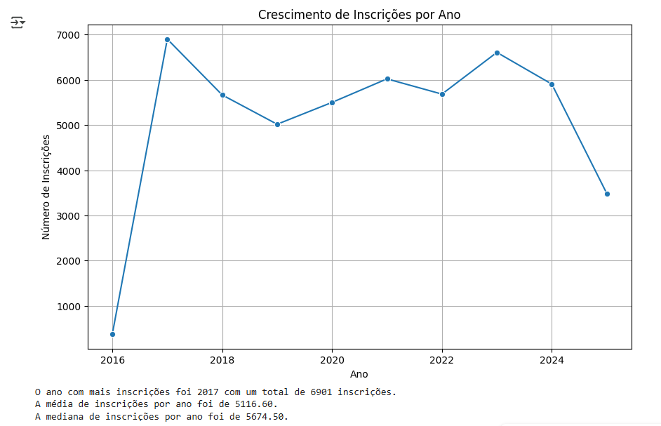

> De forma geral, o crescimento de inscrições por ano mostra que, mesmo 2017 tenha um pico de 6901 inscrições, a média de 5116,60 e a mediana de 5674,50 indicam que, ao longo dos anos, a maioria das inscrições se manteve em um nível razoável de inscrições, tendendo ao aumento.

#### 1.2 Concentração Regional

Avaliar quais estados têm maior número de inscrições. Isso pode ajudar a direcionar os esforços para uma alocação de recursos onde há maior demanda.

  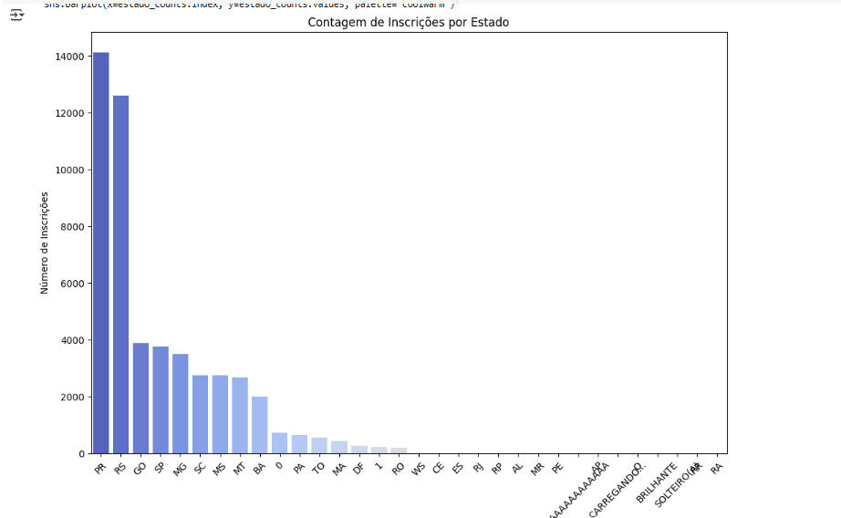

>Existe um processo para padronizar e validar entradas de dados antes da inserção?

>Existem regras definidas para a entrada das UFs, e os operadores de entrada estão seguindo essas diretrizes?

>O que pode ser feito para lidar com os valores ausentes ou em branco que aparecem com '0' nas contagens? Isso indica falhas na coleta de dados?

>Saberia explicar por qual motivo Paraná e Rio Grande do Sul apareceram com maiores inscrições sendo que o Mato Grosso é atualmente o maior produtor nacional de soja?

#### 1.3 Categorias Populares

Analisamos quais categorias têm mais inscrições. Isso pode indicar áreas de interesse ou necessidade entre os produtores, que podem priorizar ações futuras com a CESB.

  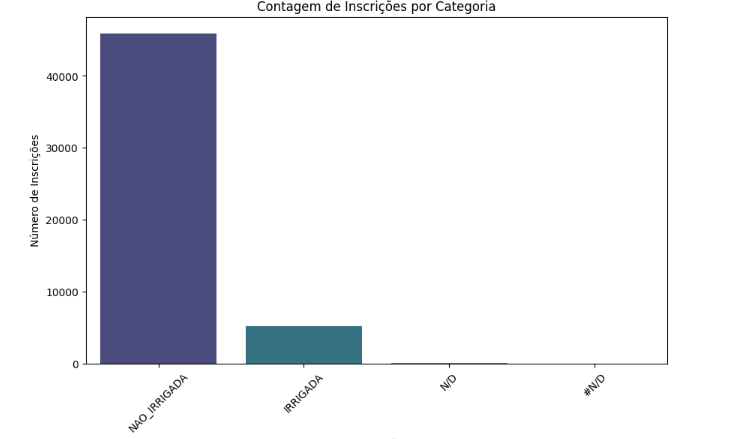

>Por que a categoria "IRRIGADA" tem um número tão baixo de inscrições (5139) em comparação com "NAO_IRRIGADA" (45928)?

>O registro de N/D e #N/D pode representar dados perdidos ou não categorizados? Como vocês tratam esses dados em Categoria?

#### 1.4 Engajamento dos Consultores

Analisamos quantas inscrições cada consultor gerou e a relação entre consultores e categorias.

  

> Como podemos entender o desempenho dos consultores com contagens baixas (1 ou 2 inscrições) em comparação com aqueles com contagens significativas?

>Quais fatores podem estar influenciando essas discrepâncias e como podemos abordar esses fatores para melhorar a eficácia da consultoria?

#### 1.5 Acompanhamento 

Verificamos como funciona a contagem de inscrições por mês. 

  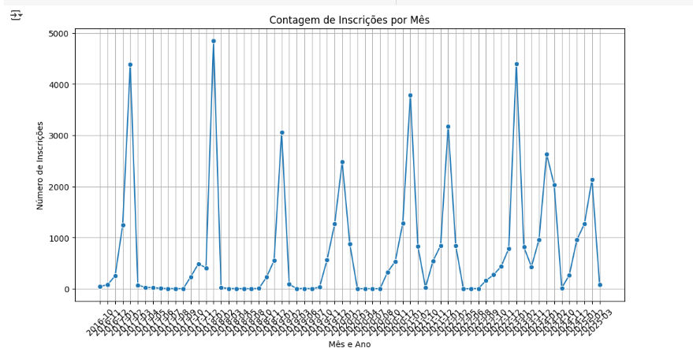

> Como se dá o acompanhamento de inscrições com os consultores?

> Existe algum plano de fidelidade e engajamento para produtores, principalmente em áreas com menor participação?

>Aparentemente, as inscrições têm um volume intenso no final do mês. Existe alguma estratégia hoje para que isso seja proposital?

### 2. Histórico Gleba 2016

#### 2.1 Análise de Cultura e Safras

Visualizar quais culturas foram mais plantadas ao longo dos anos e por safra.

  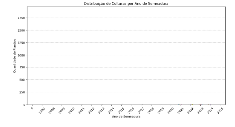

> Não existe a captação do número de quantidade de plantios ou inscrições para entender quais culturas foram mais plantadas ao longo dos anos por safra

#### 2.2 Identificação de Principais Doenças e Pragas

Verificamos as principais doenças e pragas presentes nas safras.

  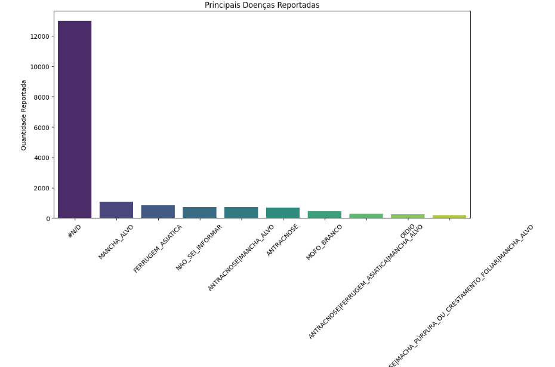

> O que representa a categoria "#N/D" com mais de 12.000 reportes? Isso indica uma falha na coleta de dados ou falta de conhecimento dos produtores sobre as doenças?

> As categorias restantes apresentam números muito baixos em comparação a "#N/D". O que pode estar impedindo os produtores de relatar doenças de forma mais variada?

#### 2.3 Manejo de Solo 

Verificamos como as técnicas de revolvimento e implementos são utilizados. 

  

> Os dados estão nulos. Que medidas podem ser tomadas para melhorar a coleta de dados sobre o manejo do solo?

> Como podemos implementar treinamentos ou ferramentas que facilitem essa coleta de informações?

#### 2.4 Custos de Produção

Verificamos o custo médio de produção por ano de semeadura. 

  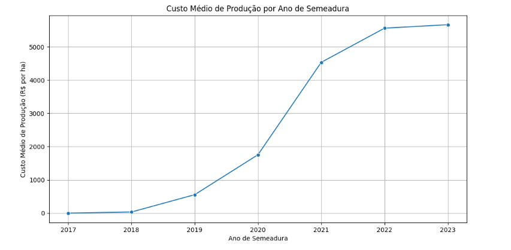

> O que pode ter contribuído para o aumento abrupto de 114,29% nos custos de produção em 2020? Esse aumento é relacionado a fatores como escassez de insumos, aumento no preço de fertilizantes, ou mudanças na legislação que impactaram os custos?

> Com o custo de produção continuando a aumentar anualmente, o que pode ser feito para investigar as causas raízes dessas variações e entender qual o range aceitável de crescimento de custo?

> Qual é a relevância de se monitorar esses fatores para mitigar custos futuros?

### 3. Correção Solo Gessagem

#### 3.1 Custos de Produção

Análise de Textura e Classificação do Solo

  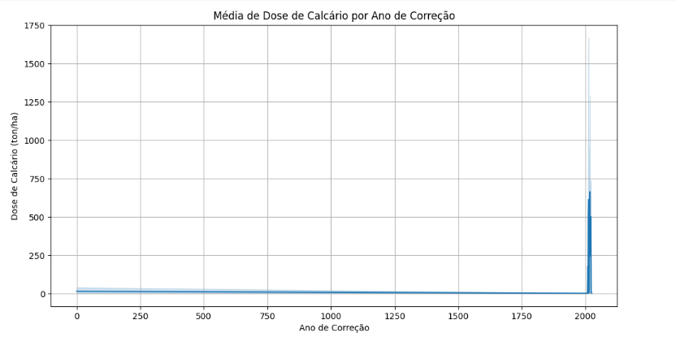

> O gráfico indica uma concentração de dados com valores muito baixos para a dose de calcário, mas um ou mais pontos elevados dados próximos a 2000 ton/ha. O que pode estar causando essa distribuição desbalanceada?

> Com a dose média de calcário aparentemente mantida em níveis baixos, que implicações isso tem sobre a eficácia das práticas de correção do solo?

#### 3.2 Análise da Gessagem e Aplicações

Verificação da distribuição de dose de gesso aplicada por ano de gessagem. 

  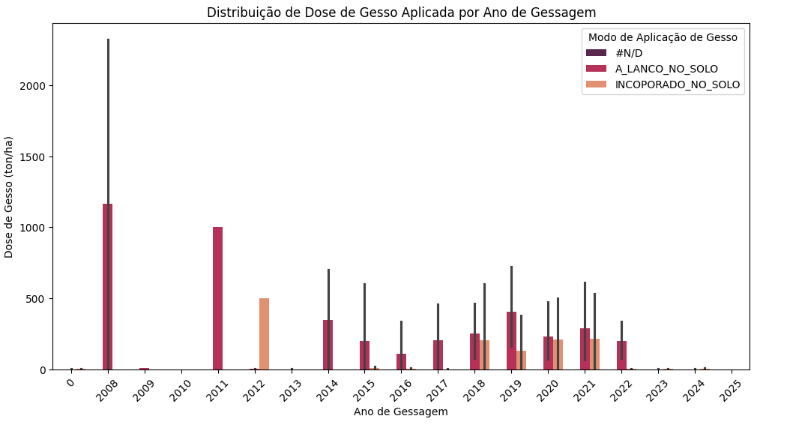

> O gráfico mostra picos significativos de dose de gesso em anos específicos (como 2008 e 2011), seguidos de valores mais baixos em anos subsequentes. Quais fatores podem ter influenciado esses altos picos de aplicação em determinados anos, e como isso impacta a eficácia geral da correção do solo nas culturas?

#### 3.3 Análise de Custos de Produção

Verificação do Custo médio de produção por ano de correção do solo. 

  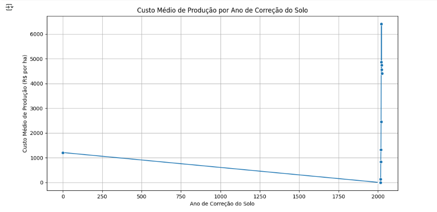

> O que pode ter contribuído para esses valores anômalos, e como isso afeta a interpretação geral do custo médio de produção?

### 4. Implantação Agrícola 

#### 4.1 Análise da Profundidade de Semeadura

Verificação da profundidade de semeadura e custos de produção. 

  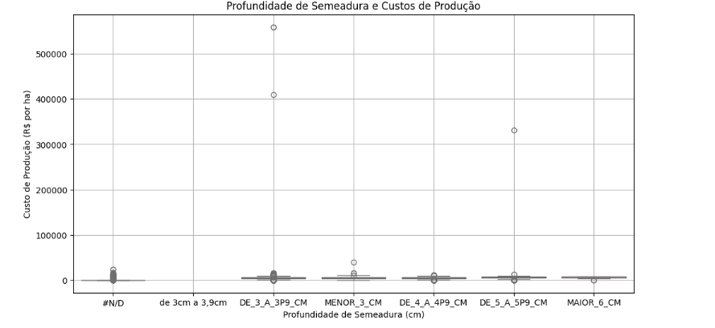

> A presença de uma categoria muito alta de registros na classe "#N/D" sugere uma falta de informações.

#### 4.2 Análise dos Custos de Produção

Verificação do custo médio de produção por data de semeadura. 

  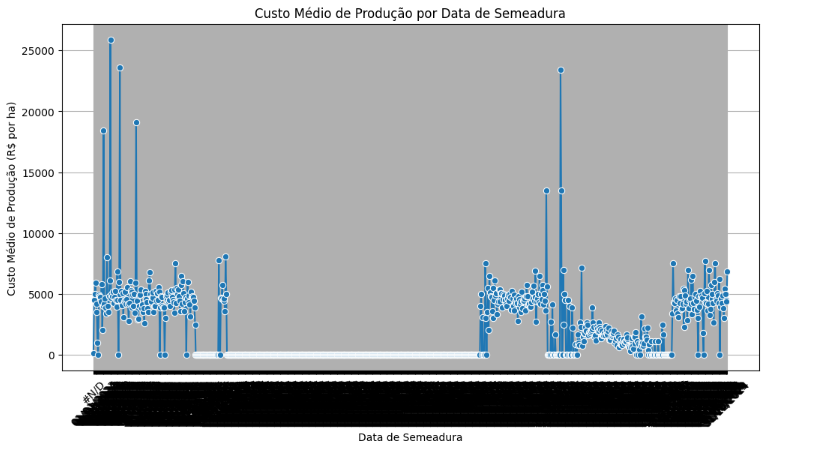

> O que poderia estar gerando essas flutuações extremas nos custos, e o quanto eventos climáticos, preços de insumos ou práticas de manejo variáveis podem ter influenciado essas discrepâncias?

> Existe um padrão nas datas onde os custos são mais elevados? Como identificar se essas datas coincidem com períodos de alta demanda por insumos, alterações climáticas ou outras variáveis que poderiam influenciar os custos?

### 5. TS - Tratamento de Sementes 

#### 5.1 Análise de Tratamento de Sementes

Verificação da quantidade de tratamentos de sementes por classe de produto

  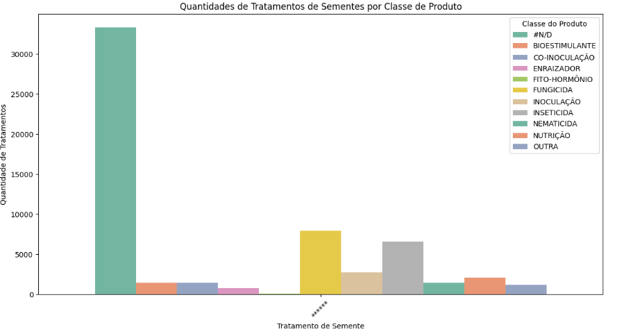

> A categoria "#N/D" representa uma quantidade significativa de tratamentos. Precisa ser limpa para ter uma análise mais significativa dos outros tratamentos

#### 5.2 Análise de Produto Utilizado

Verificação de principais produtos utilizados para tratamento de sementes. 

  

> A categoria "#N/D" representa uma quantidade extremamente elevada de dados não informados, superando 30.000. Quais são as razões que podem estar levando a essa falta de informações?

> Com vários produtos listados, mas com quantidades de uso relativamente baixas, existe um risco de não estarmos coletando os produtos para o tratamento de sementes de forma adequada. 

#### 5.3 Análise de Produtividade por Classe de Produtos

Verificação da produtividade média por classe de produto. 

  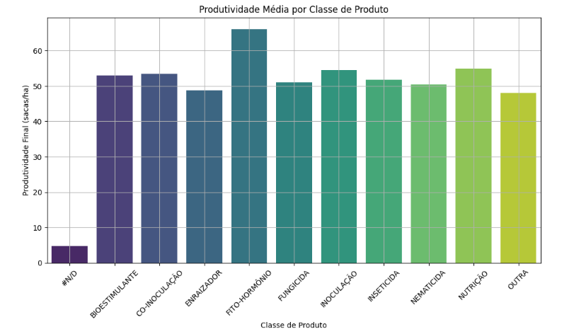

> A classe de produto "FITO-HORMÔNIO" mostra a maior produtividade média. Quais fatores podem estar impulsionando essa eficácia em comparação com outras classes, como "BIOSTIMULANTE" e "FUNGICIDA"?