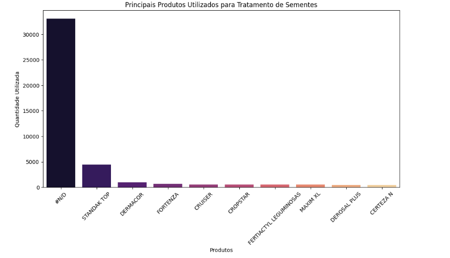

# Questionamentos CESB
O repositório tem como foco realizar uma análise de dados para questionar possíveis gargalos no gerenciamento e governança de dados da CESB

## Análise dos Excels 

- A primeira parte da análise, até o quinto Excel é realizada por meio do Pandas [Google Colab](https://colab.research.google.com/drive/1rTDTV5pTCWC0VjAy3wQcgtWmfjMKTcRC?usp=sharing);
- A segunda parte, até o 9b foi feita por meio do próprio Excel

### 1. Inscrição Cadastro 2016

Nesta análise do verificamos 5 tópicos principais:

1. Análise de Inscrições
2. Concentração Regional
3. Categorias Populares
4. Engajamento dos Consultores
5. Acompanhamento

#### 1.1 Análise das Inscrições 

Nela verificamos se há um crescimento no número de inscrições ao longo dos anos e especificar os anos em que houveram mais inscrições. Isso pode indicar um aumento na conscientização ou na promoção de programas agrícolas.

  

> De forma geral, o crescimento de inscrições por ano mostra que, mesmo 2017 tenha um pico de 6901 inscrições, a média de 5116,60 e a mediana de 5674,50 indicam que, ao longo dos anos, a maioria das inscrições se manteve em um nível razoável de inscrições, tendendo ao aumento.

#### 1.2 Concentração Regional

Avaliar quais estados têm maior número de inscrições. Isso pode ajudar a direcionar os esforços para uma alocação de recursos onde há maior demanda.

  

>Existe um processo para padronizar e validar entradas de dados antes da inserção?

>Existem regras definidas para a entrada das UFs, e os operadores de entrada estão seguindo essas diretrizes?

>O que pode ser feito para lidar com os valores ausentes ou em branco que aparecem com '0' nas contagens? Isso indica falhas na coleta de dados?

>Saberia explicar por qual motivo Paraná e Rio Grande do Sul apareceram com maiores inscrições sendo que o Mato Grosso é atualmente o maior produtor nacional de soja?

#### 1.3 Categorias Populares

Analisamos quais categorias têm mais inscrições. Isso pode indicar áreas de interesse ou necessidade entre os produtores, que podem priorizar ações futuras com a CESB.

  

>Por que a categoria "IRRIGADA" tem um número tão baixo de inscrições (5139) em comparação com "NAO_IRRIGADA" (45928)?

>O registro de N/D e #N/D pode representar dados perdidos ou não categorizados? Como vocês tratam esses dados em Categoria?

#### 1.4 Engajamento dos Consultores

Analisamos quantas inscrições cada consultor gerou e a relação entre consultores e categorias.

  

> Como podemos entender o desempenho dos consultores com contagens baixas (1 ou 2 inscrições) em comparação com aqueles com contagens significativas?

>Quais fatores podem estar influenciando essas discrepâncias e como podemos abordar esses fatores para melhorar a eficácia da consultoria?

#### 1.5 Acompanhamento 

Verificamos como funciona a contagem de inscrições por mês. 

  

> Como se dá o acompanhamento de inscrições com os consultores?

> Existe algum plano de fidelidade e engajamento para produtores, principalmente em áreas com menor participação?

>Aparentemente, as inscrições têm um volume intenso no final do mês. Existe alguma estratégia hoje para que isso seja proposital?

### 2. Histórico Gleba 2016

#### 2.1 Análise de Cultura e Safras

Visualizar quais culturas foram mais plantadas ao longo dos anos e por safra.

  

> Não existe a captação do número de quantidade de plantios ou inscrições para entender quais culturas foram mais plantadas ao longo dos anos por safra

#### 2.2 Identificação de Principais Doenças e Pragas

Verificamos as principais doenças e pragas presentes nas safras.

  

> O que representa a categoria "#N/D" com mais de 12.000 reportes? Isso indica uma falha na coleta de dados ou falta de conhecimento dos produtores sobre as doenças?

> As categorias restantes apresentam números muito baixos em comparação a "#N/D". O que pode estar impedindo os produtores de relatar doenças de forma mais variada?

#### 2.3 Manejo de Solo 

Verificamos como as técnicas de revolvimento e implementos são utilizados. 

  

> Os dados estão nulos. Que medidas podem ser tomadas para melhorar a coleta de dados sobre o manejo do solo?

> Como podemos implementar treinamentos ou ferramentas que facilitem essa coleta de informações?

#### 2.4 Custos de Produção

Verificamos o custo médio de produção por ano de semeadura. 

  

> O que pode ter contribuído para o aumento abrupto de 114,29% nos custos de produção em 2020? Esse aumento é relacionado a fatores como escassez de insumos, aumento no preço de fertilizantes, ou mudanças na legislação que impactaram os custos?

> Com o custo de produção continuando a aumentar anualmente, o que pode ser feito para investigar as causas raízes dessas variações e entender qual o range aceitável de crescimento de custo?

> Qual é a relevância de se monitorar esses fatores para mitigar custos futuros?

### 3. Correção Solo Gessagem

#### 3.1 Custos de Produção

Análise de Textura e Classificação do Solo

  

> O gráfico indica uma concentração de dados com valores muito baixos para a dose de calcário, mas um ou mais pontos elevados dados próximos a 2000 ton/ha. O que pode estar causando essa distribuição desbalanceada?

> Com a dose média de calcário aparentemente mantida em níveis baixos, que implicações isso tem sobre a eficácia das práticas de correção do solo?

#### 3.2 Análise da Gessagem e Aplicações

Verificação da distribuição de dose de gesso aplicada por ano de gessagem. 

  

> O gráfico mostra picos significativos de dose de gesso em anos específicos (como 2008 e 2011), seguidos de valores mais baixos em anos subsequentes. Quais fatores podem ter influenciado esses altos picos de aplicação em determinados anos, e como isso impacta a eficácia geral da correção do solo nas culturas?

#### 3.3 Análise de Custos de Produção

Verificação do Custo médio de produção por ano de correção do solo. 

  

> O que pode ter contribuído para esses valores anômalos, e como isso afeta a interpretação geral do custo médio de produção?

### 4. Implantação Agrícola 

#### 4.1 Análise da Profundidade de Semeadura

Verificação da profundidade de semeadura e custos de produção. 

  

> A presença de uma categoria muito alta de registros na classe "#N/D" sugere uma falta de informações.

#### 4.2 Análise dos Custos de Produção

Verificação do custo médio de produção por data de semeadura. 

  

> O que poderia estar gerando essas flutuações extremas nos custos, e o quanto eventos climáticos, preços de insumos ou práticas de manejo variáveis podem ter influenciado essas discrepâncias?

> Existe um padrão nas datas onde os custos são mais elevados? Como identificar se essas datas coincidem com períodos de alta demanda por insumos, alterações climáticas ou outras variáveis que poderiam influenciar os custos?

### 5. TS - Tratamento de Sementes 

#### 5.1 Análise de Tratamento de Sementes

Verificação da quantidade de tratamentos de sementes por classe de produto

  

> A categoria "#N/D" representa uma quantidade significativa de tratamentos. Precisa ser limpa para ter uma análise mais significativa dos outros tratamentos

#### 5.2 Análise de Produto Utilizado

Verificação de principais produtos utilizados para tratamento de sementes. 

  

> A categoria "#N/D" representa uma quantidade extremamente elevada de dados não informados, superando 30.000. Quais são as razões que podem estar levando a essa falta de informações?

> Com vários produtos listados, mas com quantidades de uso relativamente baixas, existe um risco de não estarmos coletando os produtos para o tratamento de sementes de forma adequada. 

#### 5.3 Análise de Produtividade por Classe de Produtos

Verificação da produtividade média por classe de produto. 

  

> A classe de produto "FITO-HORMÔNIO" mostra a maior produtividade média. Quais fatores podem estar impulsionando essa eficácia em comparação com outras classes, como "BIOSTIMULANTE" e "FUNGICIDA"?
Analise Erik Freundt - 

09b-Colheita_Custos_2016a2024

 Visão Geral — Estatísticas
Indicador	Valor Médio	Mínimo	Máximo
Produtividade final (sc/ha)	67,9	55,4	80,1
Custo total por hectare (R$)	R$ 3.650	R$ 3.400	R$ 4.050
Custo por saca produzida (R$/sc)	R$ 54,42	R$ 50,56	R$ 61,37
Dose de fertilizante (kg/ha)	250 kg	200	300
Dose de agroquímico (ml/ha)	1.200 ml	900	1.500

 Análise Integrada
 Melhor desempenho produtivo: Propriedade 1002
Produtividade: 80,1 sc/ha

Fertilizante: Ureia, 250 kg/ha, aplicado como "Incorporado"

Agroquímicos: 2 fungicidas, total de 900 ml/ha

Custo por saca: R$ 50,56 (mais baixo)

 Insight:
Uso de fungicidas e adubação incorporada pode estar relacionado a maior produtividade e eficiência.

Pior desempenho produtivo: Propriedade 1003
Produtividade: 55,4 sc/ha

Fertilizante: KCl, 200 kg/ha, "Cobertura"

Agroquímicos: Herbicida com maior dose: 1.500 ml/ha

Custo por saca: R$ 61,37 (mais alto)

Insight:
Apesar do alto investimento em agroquímico, a produtividade foi a menor. Pode indicar uso ineficiente ou problemas não resolvidos com herbicida isolado.

 Intermediário: Propriedade 1001
Produtividade: 68,2 sc/ha

Fertilizante: MAP, 300 kg/ha, cobertura

Agroquímico: Herbicida Roundup, 1.200 ml/ha

Custo por saca: R$ 51,32

Insight:
Alta dose de fertilizante (300 kg/ha) resultou em produtividade acima da média com custo competitivo.
Contudo, não usou fungicida — talvez exista margem de melhora.

Conclusões
Uso de fungicidas parece influenciar positivamente a produtividade e o custo por saca.

Alta dose de agroquímico não garante bom resultado, especialmente se for só herbicida.

Modo de aplicação do fertilizante (incorporado vs cobertura) pode influenciar no aproveitamento nutricional.

Fazer análise real com seus dados usando esse mesmo modelo.

Criar gráficos como:

Produtividade vs Custo por saca

Fertilizante vs Produtividade

Classe de agroquímico vs Peso mil grãos (se disponível)

Identificar propriedades com baixo custo e alta produtividade → replicar práticas.

Identificar ineficiências (alto custo com baixa produtividade) → investigar causas.

--------------------------------------------------------------------------------------------------------------------------------------------------------------------------------------------------------------------
08-Tecnologia_2016a2024.xlsx
O que contém:
Essa planilha armazena informações sobre o nível tecnológico adotado na produção agrícola, com campos como:

Cultivar_Utilizado, Populacao_Plantas, Espacamento, Biotecnologia, Uso_Piloto_Automatico, Uso_App_Monitoramento, Tipo_Plantio, Tipo_Colheita, entre outros.

 Análise:
Esse arquivo é essencial para entender o perfil tecnológico das propriedades. Mostra o grau de mecanização, tipo de manejo, e decisões agronômicas adotadas.
Entretanto, é comum encontrar campos faltantes ou marcados como #N/D, o que pode indicar falha no registro ou baixa adoção.

Combinado com produtividade e custos, esse dado ajuda a identificar se tecnologia está gerando resultado de fato.

 Perguntas:
Os cultivares utilizados foram definidos com base em características técnicas, produtividade anterior ou recomendação de consultores?

O uso de biotecnologia está disseminado nas lavouras? Há casos em que foi evitada? Por quê?

O uso de piloto automático ou apps é medido realmente no campo ou apenas relatado?

Os dados de população de plantas e espaçamento são medidos na prática ou estimados com base no plano de plantio?

Qual é o motivo da grande quantidade de registros vazios em campos como Tipo_Colheita ou Uso_App_Monitoramento? Falta de adoção ou de coleta?

Existe algum estudo interno correlacionando nível de tecnologia com produtividade nas propriedades participantes?
--------------------------------------------------------------------------------------------------------------------------------------------------------------------------------------------------------------------

09a-Colheita_Custos_2016a2024.xlsx
essa planilha reúne dados detalhados da colheita e dos custos de produção, com campos como:

Produtividade_Final_kg_ha, Peso_Bruto_kg, Umidade, Impureza, Avariados,

Custo_Mao_de_Obra, Custo_Defensivos, Custo_Adubacao, Custo_Total_ha, entre muitos outros.

Análise:
Esse é um dos arquivos mais ricos da base. Permite análises profundas de eficiência econômica, comparando custo por hectare com produtividade.
Por outro lado, muitos dados aparecem zerados ou em branco — principalmente nos componentes de custo — o que pode indicar falhas na coleta ou falta de detalhamento real do produtor.

A planilha ainda traz dados operacionais da colheita, como stand de plantas, inserção de vagens, pesagem e armazém — raramente vistos com esse nível de granularidade.

Perguntas:

Como são calculados os custos por hectare (real, estimado ou tabela padrão)?

Os dados de qualidade dos grãos (umidade, impureza, esverdeado) são coletados via laboratório, armazém ou autoavaliação?

A produtividade final é medida com auditoria de campo ou autodeclarada?

Há inconsistência entre produtividade muito alta com custo zero — isso é erro de preenchimento ou a área foi subsidiada?

Os registros de componentes de custo (mão de obra, defensivos) estão zerados em muitos casos. Por que isso acontece?

As auditorias mencionadas na planilha foram realizadas com visitas em campo ou validação documental?

Existe alguma análise comparativa entre custo total por sc vs produtividade final, ou isso ainda não foi explorado?

--------------------------------------------------------------------------------------------------------------------------------------------------------------------------------------------------------------------
06-Adubacao_2016a2024.xlsx
 O que contém:
Essa planilha registra as aplicações de fertilizantes feitas nas propriedades, contendo colunas como:

Nome_Fertilizante, Fonte, Dose, Unidade, Data_Aplicacao, Modo_Aplicacao, Custo_Producao_Reais_ha, Produtividade_Final_sc_ha.

Análise:
O objetivo da base é capturar as práticas de adubação adotadas: qual fertilizante foi usado, com que dose, por qual método e a data da aplicação.
Apesar do bom detalhamento, muitos registros costumam apresentar:

Valores zerados ou faltantes (ex: Dose = 0, Data_Aplicacao em branco),

Dificuldade em padronizar nomes de fertilizantes e unidades.

A planilha é ótima para cruzar com produtividade e investigar resposta à adubação, mas precisa de preenchimento mais robusto.

Perguntas:
As doses de fertilizante foram definidas com base em análise de solo ou recomendações padrão?

A fonte do fertilizante (NPK, MAP, ureia etc.) é sempre informada de forma padronizada?

Por que há tantos registros com dose = 0? É ausência de adubação ou falta de preenchimento?

Qual critério define o modo de aplicação (ex: incorporado, cobertura, foliar)?

Há algum controle ou validação posterior sobre a eficácia da adubação aplicada?

Como é feita a coleta dessas informações: digitalmente, planilha manual ou app de campo?
--------------------------------------------------------------------------------------------------------------------------------------------------------------------------------------------------------------------
07-Agroquimicos_2016e2024.xlsx
O que contém:
Essa planilha detalha o uso de produtos agroquímicos, como herbicidas, fungicidas e inseticidas, incluindo:

Nome_Agroquimico, Classe_Agroquimico, Fabricante, Dose, Unidade, Forma_Aplicacao, Volume_Calda_l_ha, PH_Calda.

Análise:
É uma base fundamental para entender o manejo fitossanitário das lavouras. Permite análises de:

Frequência e tipo de aplicação,

Comparação entre custo e produtividade,

Adoção de produtos comerciais e tecnologias novas.

No entanto, é comum ver muitos registros com PH_Calda em branco, doses genéricas e Forma_Aplicacao repetida.

Perguntas:
As aplicações são feitas conforme calendário técnico ou por observação em campo?

Como é registrada a dose do agroquímico — vem da nota fiscal, receita agronômica ou aplicação real?

O pH da calda é medido e registrado no campo ou estimado?

Há validação da eficácia das aplicações em relação à ocorrência de pragas/doenças?

Existem propriedades que aplicaram mais de 5 agroquímicos? Qual o racional por trás disso?

O custo das aplicações está sendo mensurado por hectare ou ainda não é incorporado nesses dados?
--------------------------------------------------------------------------------------------------------------------------------------------------------------------------------------------------------------------

## Análise Dump

Foi criado um arquivo no colab para uma melhor visualização das tabelas utilizadas e geradas, que se encontra no seguinte link: [Google Colab](https://colab.research.google.com/drive/14LJED4fVj0MgKBq0-wWp29-4aUMzfqw5?usp=sharing)

A análise foi realizada em cima do arquivo `Dump_Safras_2019a2020_(MariaDB).sql`, que contém a estrutura de um banco de dados disponibilizado pela CESB.

Para isso, foi criado um container Docker utilizando a imagem do MariaDB.

Em seguida, esse container foi conectado ao DBeaver, permitindo a importação arquivo dump e em sequência a visualização das tabelas.

Após a importação, foi executada uma consulta SQL para listar os nomes e os tipos das colunas de todas as tabelas, possibilitando por último a exportação dessas informações em formato CSV.

A partir disso, foi possível realizar uma comparação entre as informações contidas no banco de dados e os dados disponibilizados em Excel pela CESB, de modo a analisar e identificar se alguma informação relevante pode ser acrescentada em análises futuras.

O foco da análise foi logística e saúde das colheitas, e os pontos relevantes observados foram os seguintes:

### Transporte e Armazenamento
A primeira categoria de dados que chamou a atenção no dump foram as informações sobre o transporte da soja. Além dos dados de custo de produção e de venda, a tabela "`colheita_custo`" também apresenta informações relevantes sobre o transporte dessas safras, o que é muito valioso ao se considerar possíveis intercorrências que podem acontecer e causar desperdícios durante o transporte, como manejo incorreto, desvios nas rotas de transferência e outros fatores que podem reduzir a qualidade e até mesmo a quantidade da carga.

Campos como `cidade`, `distancia_armazem`, `horario_entrada_carga`, `horario_saida_carga`, `nome_armazem`, `nome_condutor`, `placa_caminhao`, `peso_bruto`, `peso_tara_caminhao` e etc, podem ser relevantes para identificar métodos de transporte e manuseio mais eficazes na preservação da soja. Além disso, esses dados podem ser utilizados em auditorias sobre o tempo de transferência entre armazéns e outras instalações. As informações sobre o armazém também podem servir como parâmetro para avaliar sua capacidade e preparo para o recebimento e armazenamento das safras, identificando assim abordagens para diminuir qualquer desperdicío durante essa etapa do processo.

Foi realizado uma consulta SQL no dump para demonstrar possíveis relações e análises que podem ser mais aprofundados a cerca das informações citadas.

Trazendo como resultado algumas informações sobre as pesagens realizadas durante o processo de colheita, demonstrando que há uma diferença dos valores entre as etapas, e também algumas avarias que podem interferir na produtividade final da colheita.

### Saúde da Safra
Embora as planilhas disponibilizadas tragam informações sobre a qualidade e classificação do solo, há muitos dados mais específicos sobre a saúde da soja em diferentes etapas da colheita, como nas tabelas "`adubacao_cobertura`", "`adubacao_organica`", "`adubacao_pre_semeadura`", "`adubacao_semeadura"` que podem ser relevantes para identificar comportamentos anormais, influenciados por pragas, sazonalidade ou ainda complementar diagnósticos relacionados a deficiências do solo, que também podem impactar diretamente a qualidade e a quantidade da colheita.

Por exemplo, a tabela "`colheita_custo`" contém campos como `avariados_totais`, `sverdeados`, `impureza`, `quebrados`, `media_pmg`, `perdas_colheitas`, `distribuicao_sementes`, `procedencia_sementes`, `graos_por_vagem`, `nematoides_controle`, `nematoides_incidencia_na_propriedade`, `nematoides_tipo`, `lacres_carregamento`, `colheita_desecacao`, `estadio_planta`, `herbicida`, `perdas_colheita`, entre outros, que podem ser bastante relevantes para identificar possíveis problemas e padrões, especialmente ao comparar os resultados com os de outras épocas do ano em que as condições de clima e solo sejam semelhantes, a fim de identificar outros problemas que podem estar passando despecebido e influenciam o resultado.

Além disso, existem as tabelas "`desafiosoja_historicaltratamentosemente`" e "`desafiosoja_historicaltratamentosementeagroquimico`", que trazem informações relevantes sobre o tratamento de sementes, como o histórico de alterações, os motivos para cada mudança, e os agrotóxicos e produtos utilizados nos tratamentos, que também pode ser utilizada para mapear e correlacionar com outras informações que tragam insights valiosos sobre interferências que minimizam a produtividade da colheita.

Abaixo tem outro exemplo de uma consulta realizada, onde da pra comparar o resultado em kg da produtividade final e algumas perdas e avarias que houveram durante a colheita.

### Implantação agrícola
Dentro do dump utilizado, existe uma tabela chamada "`implantacao_agricola`", que traz detalhes sobre as sementes por meio de campos como `tamanho_semente`, `vigor_semente` e `germinacao_semente`. Além disso, existe também informações sobre o que foi realizado no plantio, como a quantidade de sementes, o espaçamento entre elas e o espaço ocupado por metro, representados nos campos `quantidade_sementes`, `espacamento_linhas`, `sistema_distribuicao_semente` e `sementes_por_metro`. Esses dados podem ser úteis para identificar diferentes métodos de plantio da soja, com o objetivo de maximizar os resultados obtidos na colheita, além de também complementar os outros dados citados para uma análise mais aprofundada.

Abaixo está a consulta realizada para uma melhor visualização desses dados.

Realizando uma análise mais aprofundada e cruzando os dados, é possível mapear um panorama geral sobre as sementes e verificar se essas informações influenciam nos resultados de produtividade, além de identificar técnicas mais apropriadas para lidar com sementes que possuem características diferentes.

### Conclusão
Apesar de a análise do dump ter sido focada em um brainstorm e na escolha de um ponto focal, ela foi útil para identificarmos, inicialmente, aspectos do banco de dados que podem ser mais explorados com o objetivo de preservar a qualidade e a quantidade das safras, e que não eram o principal foco nos dados de análise enviados pelo CESB.

> [ChatGPT](https://chatgpt.com/share/6893634d-cd40-8005-aee3-9eacd2386f9b
) foi utilizado como apoio na criação do Docker e utilização do DBeaver e, principalmente, na correção de textos.
